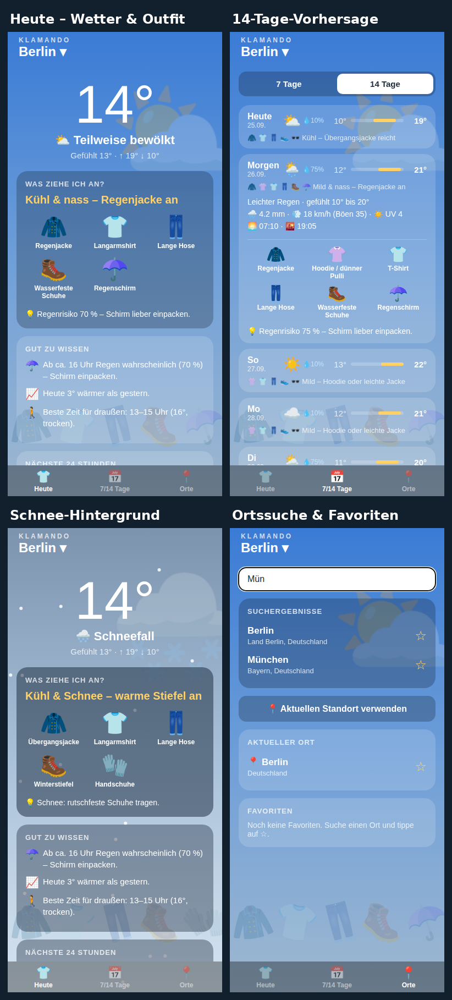

# 👕 Klamando – die Wetter-App, die dir sagt, was du anziehen sollst

[](https://github.com/Guenbay/Klamando-WetterApp-ReactNative/actions/workflows/publish.yml)
[](https://github.com/Guenbay/Klamando-WetterApp-ReactNative/releases/latest)

Klamando ist eine native Handy-App (Android & iOS, React Native + Expo SDK 57).
Sie holt das Wetter von der **kostenlosen Open-Meteo-API** (kein API-Key, keine Anmeldung)
und übersetzt es direkt in eine **Kleidungsempfehlung**.

## 🚀 Ausprobieren – ohne Installation

- **Im Browser (Web-App):** **[Klamando öffnen](https://guenbay.github.io/Klamando-WetterApp-ReactNative/)**
  Läuft auf jedem Gerät. Auf dem Handy „Zum Startbildschirm hinzufügen“ wählen,
  dann verhält sie sich wie eine installierte App.
- **Android (APK):** **[⬇️ klamando.apk herunterladen](https://github.com/Guenbay/Klamando-WetterApp-ReactNative/releases/latest/download/klamando.apk)**
  (lädt die Datei direkt herunter, ca. 130 MB). Auf dem Handy öffnen und bei Bedarf
  „Installation aus unbekannter Quelle“ erlauben. Kostenlos, kein Konto nötig.
  <br>Alternativ manuell: rechts auf dieser Repo-Seite unter **„Releases“** auf
  **„Klamando – neueste Version“** klicken, dort unter **Assets** auf `klamando.apk`.
- **iPhone:** aktuell nur über die Web-App oben (kein Apple-Developer-Konto vorhanden).

Beides wird bei jeder Änderung an `main` automatisch neu gebaut (siehe
[`.github/workflows/publish.yml`](.github/workflows/publish.yml)) – der Badge oben
zeigt, ob der letzte Bau-Vorgang erfolgreich war.

<p align="center">
  
</p>

## Funktionen

| | |
|---|---|
| 🌡️ **Aktuelles Wetter** | Temperatur, gefühlte Temperatur, Wind/Böen, Luftfeuchte, UV, Sonnenauf-/untergang |
| 👕 **Was ziehe ich an?** | Outfit aus gefühlter Temperatur, Regen, Schnee, Wind und UV – mit Bildern der Kleidungsstücke |
| 🎨 **Dynamischer Hintergrund** | Farbverlauf nach Wetter & Tageszeit, animierter Regen/Schnee, empfohlene Kleidung als Hintergrundbild |
| ⏱️ **24-Stunden-Verlauf** | Temperatur und Regenwahrscheinlichkeit pro Stunde |
| 📅 **7- und 14-Tage-Vorhersage** | Umschaltbar, mit Temperaturbalken und Outfit pro Tag (antippen für Details) |
| 📍 **Standort & Suche** | GPS oder weltweite Ortssuche, Favoriten mit ⭐ |

## Was Klamando besser macht als andere Wetter-Apps

- **Antwort statt Zahlen:** Statt „13°, 70 %“ steht da „Kühl & nass – Regenjacke an“.
- **Regen-Timing:** „Ab ca. 16 Uhr Regen wahrscheinlich – Schirm einpacken“ bzw. „Regen hört gegen 17 Uhr auf“.
- **Schirm-Logik:** Bei Sturmböen rät die App von Schirm ab und empfiehlt eine Kapuze.
- **Zwiebellook-Hinweis:** Warnt, wenn Morgen und Nachmittag weit auseinanderliegen.
- **Vergleich mit gestern:** „Heute 5° kälter als gestern – etwas wärmer anziehen.“
- **Beste Zeit für draußen:** Das angenehmste trockene 2-Stunden-Fenster des Tages.
- **Nachtfrost-Warnung** für Autoscheibe und Pflanzen.
- **Ehrliche 14 Tage:** Ab Tag 8 wird klar als „Trend“ markiert, statt falsche Genauigkeit vorzutäuschen.
- **Offline-fähig:** Die letzte Vorhersage wird gespeichert und bei fehlendem Netz mit Zeitstempel angezeigt.
- **Keine Werbung, kein Tracking, kein Konto, kein API-Key.**

## Lokal entwickeln (Expo Go)

1. [Node.js](https://nodejs.org) (LTS) installieren.
2. Abhängigkeiten installieren:
   ```bash
   npm install
   ```
3. Entwicklungsserver starten:
   ```bash
   npx expo start
   ```
4. Auf dem Handy die App **Expo Go** installieren (App Store / Play Store) und den QR-Code scannen.
   Handy und Rechner müssen im selben WLAN sein (sonst `npx expo start --tunnel`).

## Eigene APK bauen (optional)

Die fertige APK gibt es unter [Releases](https://github.com/Guenbay/Klamando-WetterApp-ReactNative/releases/latest) –
das hier ist nur nötig, wenn ihr selbst und mit eigenem Expo-Konto bauen wollt:

```bash
npm install -g eas-cli
eas login
eas build -p android --profile preview
```

Für iOS: `eas build -p ios` (benötigt einen Apple-Developer-Account).

## Tests

Die Logik (Outfit-Empfehlung, Regen-Timing, Datenaufbereitung) ist mit Unit-Tests abgedeckt:

```bash
npm test
```

## Projektstruktur

```
App.js                      Einstieg, Tab-Navigation, Header
src/api/openMeteo.js        Wetter- und Orts-API (Open-Meteo)
src/logic/outfit.js         Kleidungsempfehlung
src/logic/forecast.js       Datenaufbereitung + smarte Hinweise
src/logic/weatherCodes.js   WMO-Wettercodes → Text/Symbol
src/logic/theme.js          Hintergrundfarben je Wetter
src/components/             Hintergrund-Animation, UI-Bausteine
src/screens/                Heute, 7/14 Tage, Orte
src/useWeather.js           Laden, Standort, Offline-Cache
tests/                      Unit-Tests
.github/workflows/          Automatisches Bauen & Veröffentlichen (Web + APK)
```

## Lizenz

[MIT](LICENSE) – frei nutzbar, veränderbar und weitergebbar für alle.

Wetterdaten: [Open-Meteo.com](https://open-meteo.com) (CC BY 4.0).

Erstellt von Lina, Ziko, Günbay Sali.
